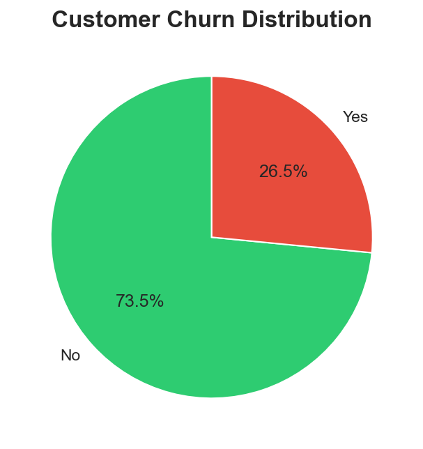
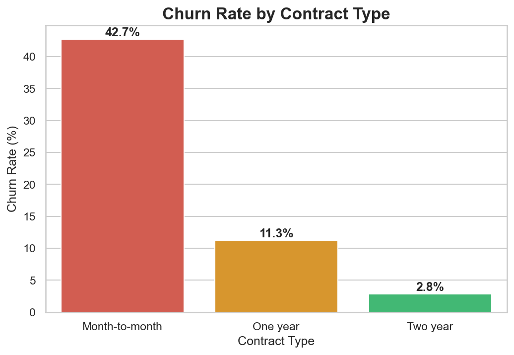
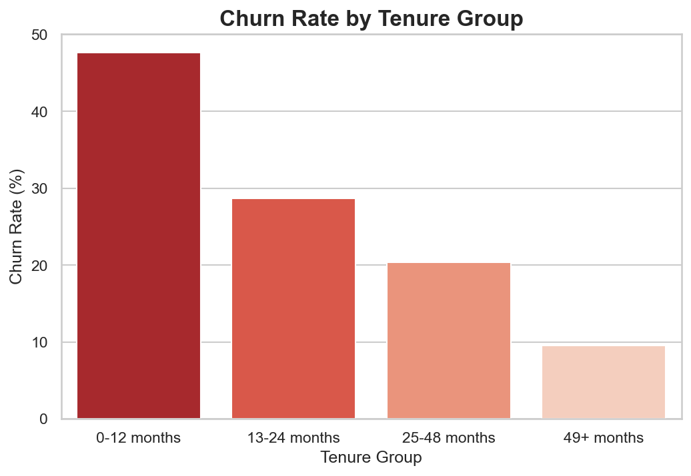
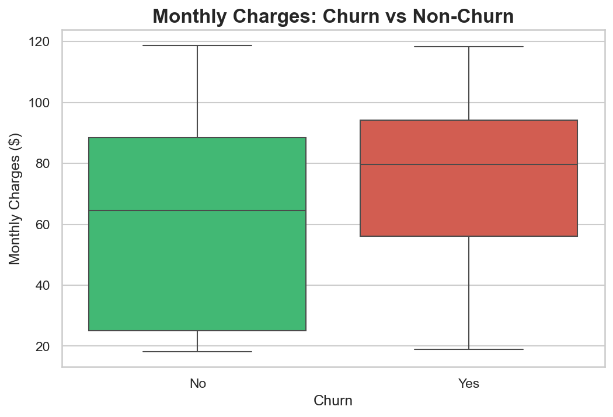

# 🧮 Customer Churn Analysis — Telco Dataset


> An end-to-end exploratory data analysis (EDA) project to identify key factors driving customer churn in a telecom company — using SQL for querying and Python for statistical analysis and visualization.

---

## 📌 Project Overview

This project analyzes the **Telco Customer Churn dataset** (7,043 customers) to understand why customers leave and which segments are most at risk. The insights from this analysis can be used to build targeted retention strategies.

---

## 🎯 Problem Statement

A telecom company is experiencing a **26% churn rate** with no clear understanding of which customer segments are most at risk or what factors are driving the decision to cancel subscriptions.

**Goal:** Identify the key drivers of churn and provide actionable recommendations to reduce it.

---

## 💡 Key Insights

- 📊 **26% overall churn rate** — 1 in 4 customers are leaving
- 📋 **Month-to-month contracts** have the highest churn rate at **42.71%** — nearly 3x higher than annual contracts
- ⏳ **New customers are most vulnerable** — tenure 0–12 months shows the highest churn rate
- 👤 **Gender has no significant impact** on churn — churn is driven by service & contract factors, not demographics
- 💰 **Churned customers pay more** — avg. $74.44/month vs $61.27/month for retained customers, suggesting poor perceived value at higher price points

---

## 🛠️ Tools & Technologies

| Tool | Purpose |
|------|---------|
| Python | Data analysis & visualization |
| Pandas | Data manipulation & cleaning |
| SQLite | Data querying & aggregation |
| Seaborn & Matplotlib | Data visualization |
| Jupyter Notebook | Development environment |

---

## ⚙️ Process

### 1. Data Understanding
- Dataset: 7,043 rows × 21 columns
- Target variable: `Churn` (Yes/No)
- No missing values or duplicates found

### 2. SQL Analysis
Performed 5 key queries using SQLite:
- Overall churn rate distribution
- Churn rate by contract type
- Churn rate by tenure group
- Churn rate by gender
- Average monthly charges: churn vs non-churn

### 3. Python Visualization (Seaborn & Matplotlib)
Built 4 visualizations:
- Churn distribution pie chart
- Churn rate by contract type bar chart
- Churn rate by tenure group bar chart
- Monthly charges boxplot: churn vs non-churn

---

## 📊 Visualizations

### Churn Distribution


### Churn Rate by Contract Type


### Churn Rate by Tenure Group


### Monthly Charges: Churn vs Non-Churn


---

## 💡 Recommendations

Based on the analysis, here are actionable retention strategies:

1. **Incentivize long-term contracts** — offer discounts for customers switching from month-to-month to annual contracts
2. **Focus on the first 12 months** — create an onboarding program for new customers to reduce early churn
3. **Review pricing for high-paying customers** — churned customers pay significantly more, suggesting a value perception problem
4. **Launch targeted retention campaigns** for month-to-month contract holders with tenure < 12 months — this is the highest risk segment

---

## 📁 Repository Structure

```
customer-churn-analysis/
│
├── data/
│   └── WA_Fn-UseC_-Telco-Customer-Churn.csv   # Raw dataset
│
├── images/
│   ├── churn_distribution.png
│   ├── churn_by_contract.png
│   ├── churn_by_tenure.png
│   └── monthly_charges_churn.png
│
├── notebook/
│   └── customer_churn_analysis.ipynb           # Jupyter Notebook
│
├── telco_churn.db                              # SQLite database
└── README.md
```

---

## 📂 Dataset

- **Source:** [Kaggle — Telco Customer Churn](https://www.kaggle.com/datasets/blastchar/telco-customer-churn)
- **Rows:** 7,043 customers
- **Features:** 21 columns including tenure, contract type, monthly charges, and churn status

---

## 👤 Author

**Apriandi Manurung**
- 📧 Email: apriandimanurung@email.com
- 💼 LinkedIn: [linkedin.com/in/apriandimanurung](https://linkedin.com/in/apriandimanurung)
- 🌐 Portfolio: [Notion Portfolio](#)

---

*If you found this project helpful, feel free to ⭐ star this repository!*
